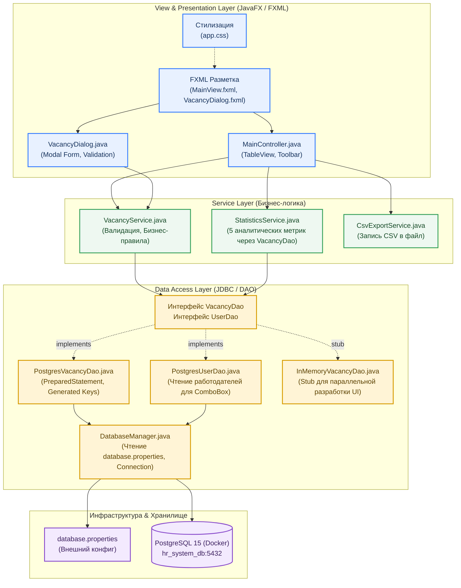
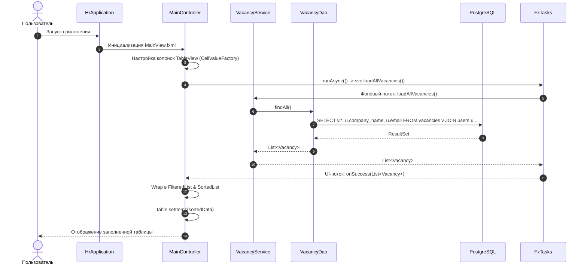
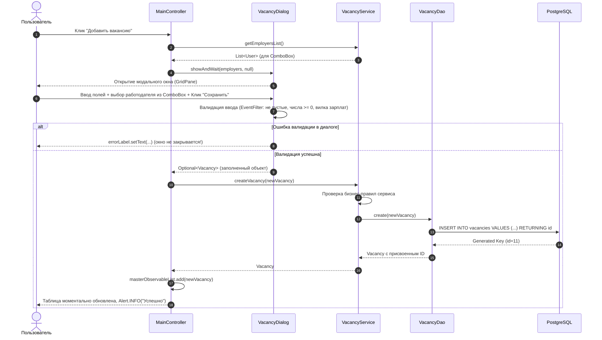
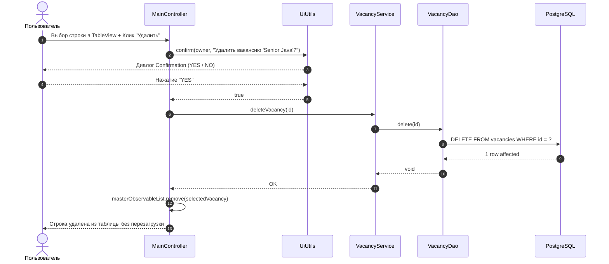

# 01. Системная архитектура настольного JavaFX-приложения (КР2)

## 1. Введение и архитектурные принципы

В рамках Контрольной работы №2 разрабатывается полноценное настольное приложение (Desktop GUI) на базе **JavaFX 21** и **Java 21**, предназначенное для управления системой подбора специалистов и вакансий (**HireSystemForSpecialists / HR-система**).

Приложение сохраняет предметную область, базу данных PostgreSQL 15 и структуру сущностей из КР №1, но заменяет консольный интерфейс на современный графический интерфейс с табличным представлением данных, модальными окнами, динамической фильтрацией, панелью аналитики и экспортом.

### Ключевые архитектурные принципы (в соответствии с требованиями КР №2 и Agile-методологией)

1. **Многослойное разделение ответственности (Separation of Concerns)**:
   - **View / FXML / CSS**: Декларативная разметка интерфейса и визуальный стиль. Никакой логики внутри FXML.
   - **Controller (JavaFX)**: Управление жизненным циклом UI-элементов, перехват событий пользователя, делегирование обработки сервисному слою и обновление `ObservableList`.
   - **Service Layer**: Бизнес-логика, валидация данных, расчет статистических показателей, формирование CSV-отчетов. Слой не зависит от JavaFX-компонентов.
   - **Repository / DAO (Data Access Object)**: Чистый JDBC-доступ к PostgreSQL (`PreparedStatement`, маппинг `ResultSet`, транзакции). Никаких обращений к БД напрямую из контроллеров кнопок!
   - **Database**: Хранилище PostgreSQL 15, развернутое в Docker Compose.
2. **Программирование через интерфейсы и слабая связанность**:
   - `VacancyDao` и `UserDao` определены через интерфейсы.
   - На этапе старта спринта предоставляется **`InMemoryVacancyDao` (Stub)**, что позволяет фронтенд-разработчику (Глебу) разрабатывать и тестировать `TableView` и экранные формы без ожидания готовности реальной БД и JDBC-слоя.
3. **Безопасная конфигурация без хардкода**:
   - Реквизиты подключения к PostgreSQL вынесены в `src/main/resources/database.properties` и загружаются динамически через `ClassLoader`.
4. **Реактивность и потокобезопасность JavaFX**:
   - Данные для таблиц хранятся в `ObservableList<Vacancy>`, обеспечивая реактивное обновление строк в `TableView`.
   - Долгие операции (загрузка из БД, диалоги с `userDao`, расчёт статистики, экспорт) выносятся вне JavaFX Application Thread через `ui/util/FxTasks.java` — обёртку над `Task<T>`. Колбэки `success`/`failure` приходят на FX-поток.
   - Это правило становится обязательным после задач T4 (загрузка и диалоги), T5 и T7 (статистика). До их выполнения вызовы шли прямо в FX-потоке.

---

## 2. Общая схема архитектуры (C4 Component Diagram)



---

## 3. Структура каталогов и пакетов проекта Maven

Проект собирается стандартным Maven с Java 21 и JavaFX плагином:

```
2_kr/javafx-client/
├── pom.xml                                  # Конфигурация Java 21, JavaFX 21, PostgreSQL JDBC Driver
├── docker-compose.yml                       # Запуск контейнера PostgreSQL 15 (КР1 база)
├── init.sql                                 # DDL и Seed Data из КР1
├── migration_v2.sql                         # Миграция схемы КР1 → КР2 (колонки company_name, full_name, description)
├── .env                                     # Переменные окружения Docker
│
└── src/
    ├── main/
    │   ├── java/ru/mirea/hrsystem/
    │   │   ├── HrApplication.java           # Наследник javafx.application.Application (Start / Stage)
    │   │   ├── Launcher.java                # Точка входа без наследования Application (для сборки JAR)
    │   │   │
    │   │   ├── model/
    │   │   │   ├── Vacancy.java             # Доменная модель (JavaFX Property / POJO)
    │   │   │   ├── User.java                # Связанная сущность (Работодатель / Менеджер)
    │   │   │   ├── VacancyStatus.java       # Enum (ACTIVE, ARCHIVED, REJECTED)
    │   │   │   └── StatisticsDto.java       # DTO 5 статистических показателей
    │   │   │
    │   │   ├── repository/
    │   │   │   ├── VacancyDao.java          # Интерфейс CRUD операций вакансий
    │   │   │   ├── UserDao.java             # Интерфейс выборки работодателей для ComboBox
    │   │   │   ├── PostgresVacancyDao.java  # JDBC реализация (PreparedStatement)
    │   │   │   ├── PostgresUserDao.java     # JDBC реализация списка пользователей
    │   │   │   └── InMemoryVacancyDao.java  # Stub-заглушка для автономной разработки UI
    │   │   │
    │   │   ├── service/
    │   │   │   ├── VacancyService.java      # Валидация, архивация, поиск, CRUD координация
    │   │   │   ├── StatisticsService.java   # Расчет 5 метрик аналитики
    │   │   │   └── CsvExportService.java    # Экспорт TableView / ObservableList в CSV
    │   │   │
    │   │   ├── exception/
    │   │   │   ├── BusinessException.java   # Нарушение бизнес-правил
    │   │   │   ├── ValidationException.java # Ошибки ввода полей
    │   │   │   └── DatabaseException.java   # Обертка над SQLException
    │   │   │
    │   │   ├── ui/
    │   │   │   ├── MainController.java      # FXML-контроллер основного экрана
    │   │   │   ├── VacancyDialog.java       # Модальное диалоговое окно добавления/редактирования
    │   │   │   ├── StatisticsDialog.java    # Модальное окно статистики (5 метрик)
    │   │   │   └── util/
    │   │   │       ├── UiUtils.java         # Хелперы для Alert (ошибки, инфо, confirm)
    │   │   │       └── FxTasks.java         # Фоновый запуск задач через Task<T> вне FX-потока
    │   │   │
    │   │   └── util/
    │   │       └── DatabaseManager.java     # Чтение database.properties и DriverManager
    │   │
    │   └── resources/
    │       ├── database.properties          # Параметры подключения к PostgreSQL
    │       ├── ru/mirea/hrsystem/
    │       │   ├── view/
    │       │   │   ├── MainView.fxml        # FXML разметка главного окна
    │       │   │   └── VacancyDialog.fxml   # FXML форма вакансии
    │       │   └── css/
    │       │       └── app.css              # Таблица стилей JavaFX (дизайн из примера)
    │
    └── test/java/ru/mirea/hrsystem/
        └── VacancyServiceTest.java          # Юнит-тесты бизнес-правил и валидации
```

---

## 4. Стек технологий

| Компонент | Технология / Библиотека | Назначение |
|---|---|---|
| **Язык разработки** | Java 21 (LTS) | Рекорд-классы, pattern matching, switch expressions |
| **GUI Framework** | OpenJFX 21.0.8 (`javafx-controls`, `javafx-fxml`) | Таблицы, модальные диалоги, FXML, сцена и сценарий |
| **Стилизация** | JavaFX CSS (`app.css`) | Стилизация кнопок, карточек, строк таблицы и диалогов |
| **Сборка** | Apache Maven 3.9+ (`javafx-maven-plugin`) | Управление зависимостями, запуск `mvn javafx:run` |
| **СУБД** | PostgreSQL 15 | База данных из КР №1 (`hr_system_db`) |
| **Драйвер БД** | PostgreSQL JDBC Driver 42.7.13 | Чистый JDBC (`PreparedStatement`, `ResultSet`) |
| **Контейнеризация**| Docker & Docker Compose | Развертывание PostgreSQL |
| **Тестирование** | JUnit 5.13 + AssertJ 3.27 | Модульное и интеграционное тестирование |
| **Логирование** | SLF4J 2.0.17 + SimpleLogger | Протоколирование операций вместо System.out |

---

## 5. Взаимодействие компонентов (Sequence Diagrams)

### 5.1. Загрузка данных и инициализация TableView



### 5.2. Добавление вакансии через модальный диалог со связанной сущностью



### 5.3. Удаление с обязательным подтверждением



---

## 6. Решение проблемы блокировок между разработчиками: Walking Skeleton & Stubs

На основе книги Джеймса Шора «Искусство Agile-разработки», главное узкое место команды — это **ожидание завершения чужой работы** (UI ждет репозиторий, репозиторий ждет базу).

В нашей архитектуре это устранено полностью:
1. **Единые интерфейсы согласованы в День 1**: Все методы сигнатур `VacancyDao`, `UserDao`, `VacancyService` фиксируются в коде за 2 часа.
2. **`InMemoryVacancyDao` (Стаб-заглушка)**: Хранит данные в `CopyOnWriteArrayList<Vacancy>` в памяти. Глеб сразу подключает его к контроллеру JavaFX и разрабатывает интерфейс, верстает FXML и CSS, не обращая внимания на статус базы данных.
3. **Бесшовная замена**: Когда Максим и Эдик сдают проверенный `PostgresVacancyDao`, `HrApplication.start` переключает реализацию DAO: `PostgresVacancyDao(dbManager)` при доступной БД, иначе `InMemoryVacancyDao`. Все слои продолжают работать без модификации кода UI.
