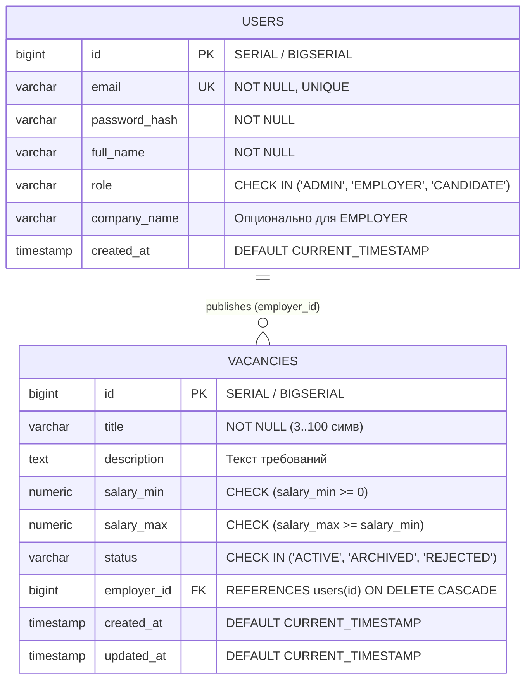

# 03. Архитектура базы данных и интеграция с JDBC (КР2)

> **СУБД:** PostgreSQL 15 (Docker)  
> **База данных:** `hr_system_db`  
> **Драйвер:** `org.postgresql:postgresql:42.7.13`

---

## 1. Концептуальная и логическая модель данных

Схема из Контрольной работы №1 является основой предметной области, но под требования КР №2 она расширяется миграцией `migration_v2.sql`: добавлены колонки `users.full_name`, `users.company_name` и `vacancies.description`. Система построена вокруг двух ключевых взаимосвязанных сущностей: **Пользователи (Работодатели / Рекрутеры)** и **Вакансии**.

### 1.1. ER-диаграмма сущностей (Mermaid)



---

## 2. DDL-скрипт создания таблиц (`init.sql`)

```sql
-- Создание расширения и очистка при повторном запуске
CREATE TABLE IF NOT EXISTS users (
    id BIGSERIAL PRIMARY KEY,
    email VARCHAR(255) NOT NULL UNIQUE,
    password_hash VARCHAR(255) NOT NULL,
    full_name VARCHAR(150) NOT NULL,
    role VARCHAR(50) NOT NULL DEFAULT 'EMPLOYER' CHECK (role IN ('ADMIN', 'EMPLOYER', 'CANDIDATE')),
    company_name VARCHAR(150),
    created_at TIMESTAMP WITHOUT TIME ZONE DEFAULT CURRENT_TIMESTAMP
);

CREATE TABLE IF NOT EXISTS vacancies (
    id BIGSERIAL PRIMARY KEY,
    title VARCHAR(150) NOT NULL,
    description TEXT,
    salary_min NUMERIC(12, 2) CHECK (salary_min >= 0),
    salary_max NUMERIC(12, 2),
    status VARCHAR(50) NOT NULL DEFAULT 'ACTIVE' CHECK (status IN ('ACTIVE', 'ARCHIVED', 'REJECTED')),
    employer_id BIGINT NOT NULL REFERENCES users(id) ON DELETE CASCADE,
    created_at TIMESTAMP WITHOUT TIME ZONE DEFAULT CURRENT_TIMESTAMP,
    updated_at TIMESTAMP WITHOUT TIME ZONE DEFAULT CURRENT_TIMESTAMP,
    CONSTRAINT chk_salary_range CHECK (salary_max IS NULL OR salary_min IS NULL OR salary_max >= salary_min)
);

-- Индексы для ускорения поиска и фильтрации
CREATE INDEX IF NOT EXISTS idx_vacancies_employer_id ON vacancies(employer_id);
CREATE INDEX IF NOT EXISTS idx_vacancies_status ON vacancies(status);
CREATE INDEX IF NOT EXISTS idx_vacancies_title ON vacancies(title);
```

### 2.1. Миграция из КР №1

Схема КР №1 служит основой, но не покрывает требования КР №2: в ней отсутствуют `users.full_name`, `users.company_name` и `vacancies.description`. Для приведения существующей базы КР №1 к актуальной схеме используется идемпотентный скрипт `javafx-client/migration_v2.sql`. Он добавляет недостающие колонки (`ADD COLUMN IF NOT EXISTS`) и выполняет бэкфилл данных: `users.full_name` заполняется из локальной части `email`, а `users.company_name` — из `vacancies.company_name` для соответствующих работодателей. Скрипт можно запускать повторно.

Запуск против поднятой БД КР №1 (контейнер `hr-system-postgres`):

```bash
docker exec -i hr-system-postgres psql -U hr_user -d hr_system_db < migration_v2.sql
```

---

## 3. Тестовые данные (Seed Data)

Для комфортной проверки всех функций JavaFX-приложения подготовлен набор данных:

```sql
INSERT INTO users (email, password_hash, full_name, role, company_name) VALUES
('yandex_hr@yandex.ru', 'hash1', 'Анна Смирнова', 'EMPLOYER', 'Яндекс'),
('sber_hr@sber.ru', 'hash2', 'Иван Ковалев', 'EMPLOYER', 'СберТех'),
('tinkoff_hr@tbank.ru', 'hash3', 'Елена Романова', 'EMPLOYER', 'Т-Банк'),
('ozon_hr@ozon.ru', 'hash4', 'Дмитрий Волков', 'EMPLOYER', 'Озон'),
('admin@mirea.ru', 'adminhash', 'Главный Администратор', 'ADMIN', 'HR-Агентство МИРЭА')
ON CONFLICT (email) DO NOTHING;

INSERT INTO vacancies (title, description, salary_min, salary_max, status, employer_id) VALUES
('Java Backend Developer', 'Разработка микросервисов на Spring Boot и PostgreSQL', 160000, 240000, 'ACTIVE', 1),
('Senior Java / Kotlin Архитектор', 'Проектирование распределенных отказоустойчивых систем', 320000, 450000, 'ACTIVE', 2),
('Junior Java QA Automation', 'Написание автотестов JUnit 5, Selenide, CI/CD', 80000, 110000, 'ACTIVE', 3),
('Team Lead Java разработки', 'Управление командой из 6 разработчиков, Agile / Scrum', 350000, 480000, 'ARCHIVED', 1),
('Java Desktop Developer (JavaFX)', 'Поддержка и развитие десктопного инструментария', 140000, 200000, 'ACTIVE', 4),
('Middle Spring Boot Engineer', 'Интеграция с платежными шлюзами и брокерами Kafka', 190000, 260000, 'ACTIVE', 3),
('Стажер Java Developer', 'Участие в open-source проектах и обучение в команде', 45000, 65000, 'ACTIVE', 2),
('Legacy Java 8 Support Specialist', 'Рефакторинг старых монолитных систем', 120000, 150000, 'REJECTED', 4);
```

---

## 4. Конфигурация подключения (`database.properties`)

В соответствии с требованиями `2.txt`, параметры подключения к СУБД вынесены из Java-классов в отдельный ресурс `src/main/resources/database.properties`:

```properties
# Параметры подключения к базе данных КР №2
db.url=jdbc:postgresql://localhost:5432/hr_system_db
db.user=hr_user
db.password=hr_password
db.driver=org.postgresql.Driver
db.pool.max_total=10
```

Загрузка выполняется через служебный класс `DatabaseManager`:
```java
Properties props = new Properties();
try (InputStream in = DatabaseManager.class.getClassLoader().getResourceAsStream("database.properties")) {
    props.load(in);
}
```

---

## 5. Маппинг данных (SQL ↔ Java Model ↔ JavaFX UI)

| Колонка БД | SQL Тип | Поле Java Model (`Vacancy.java`) | Тип в JavaFX TableView | Отображение в UI |
|---|---|---|---|---|
| `id` | `BIGINT` | `Long id` | `SimpleLongProperty` | Числовой ID |
| `title` | `VARCHAR(150)` | `String title` | `SimpleStringProperty` | Заголовок вакансии |
| `employer_id` | `BIGINT` | `Long employerId` / `User employer` | `SimpleStringProperty` | Название компании работодателя |
| `salary_min` | `NUMERIC(12,2)` | `BigDecimal salaryMin` | `SimpleObjectProperty<BigDecimal>` | Денежный формат: `160 000 ₽` |
| `salary_max` | `NUMERIC(12,2)` | `BigDecimal salaryMax` | `SimpleObjectProperty<BigDecimal>` | Денежный формат: `240 000 ₽` |
| `status` | `VARCHAR(50)` | `VacancyStatus status` | `SimpleObjectProperty<VacancyStatus>` | Цветной бейдж статуса |
| `created_at` | `TIMESTAMP` | `LocalDateTime createdAt` | `SimpleStringProperty` | Дата: `07.10.2026` |

---

## 6. Ключевые параметризованные SQL-запросы (PreparedStatement)

### 6.1. Выборка всех вакансий со связанным работодателем (JOIN)
```sql
SELECT v.id, v.title, v.description, v.salary_min, v.salary_max, v.status, v.created_at, v.updated_at,
       u.id AS emp_id, u.email AS emp_email, u.full_name AS emp_name, u.company_name AS emp_company
FROM vacancies v
JOIN users u ON v.employer_id = u.id
ORDER BY v.id DESC;
```

### 6.2. Вставка вакансии с получением сгенерированного ключа
```sql
INSERT INTO vacancies (title, description, salary_min, salary_max, status, employer_id, created_at, updated_at)
VALUES (?, ?, ?, ?, ?, ?, CURRENT_TIMESTAMP, CURRENT_TIMESTAMP);
```
*(Выполняется с флагом `Statement.RETURN_GENERATED_KEYS`).*

### 6.3. Обновление записи
```sql
UPDATE vacancies
SET title = ?, description = ?, salary_min = ?, salary_max = ?, status = ?, employer_id = ?, updated_at = CURRENT_TIMESTAMP
WHERE id = ?;
```

### 6.4. Удаление записи
```sql
DELETE FROM vacancies WHERE id = ?;
```

### 6.5. Расчет аналитики
Расчет статистики больше не выполняется через SQL-агрегаты (`COUNT(*) FILTER`). Согласно новой архитектуре (задача T7), `StatisticsService` вызывает метод `findAll()` и считает все 5 метрик средствами Java (`Stream API`). Это снижает нагрузку на базу данных и упрощает код.
