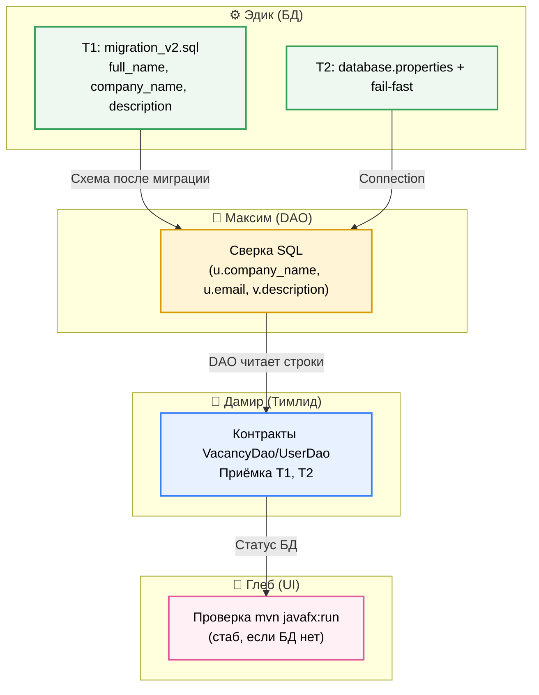
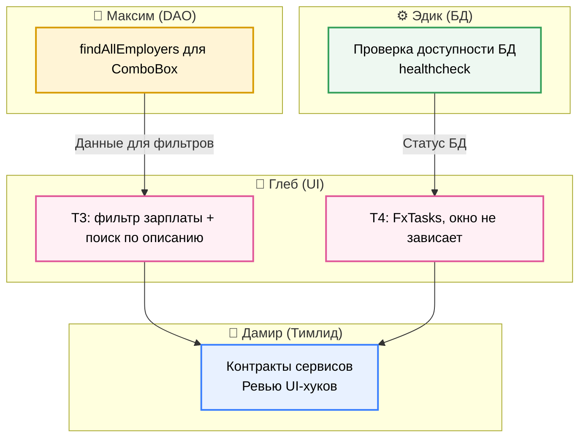
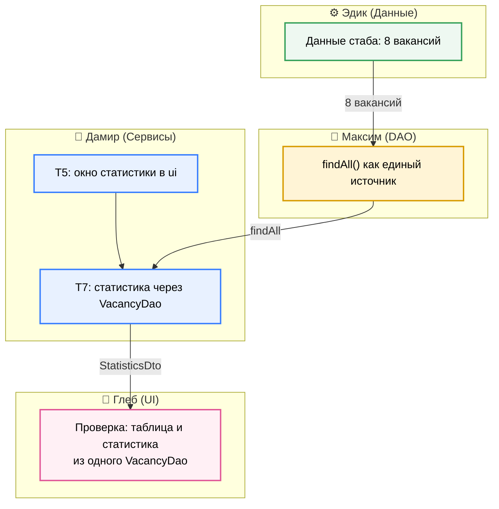
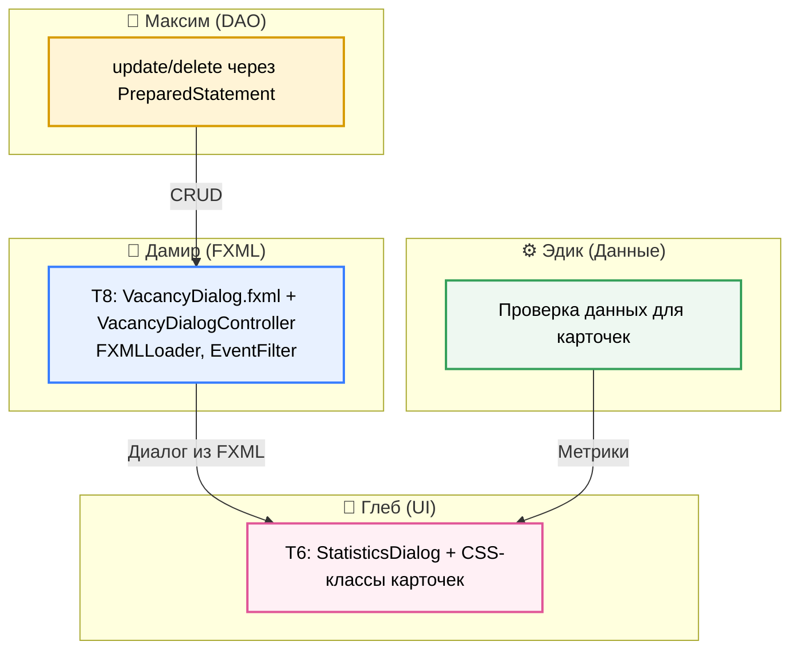
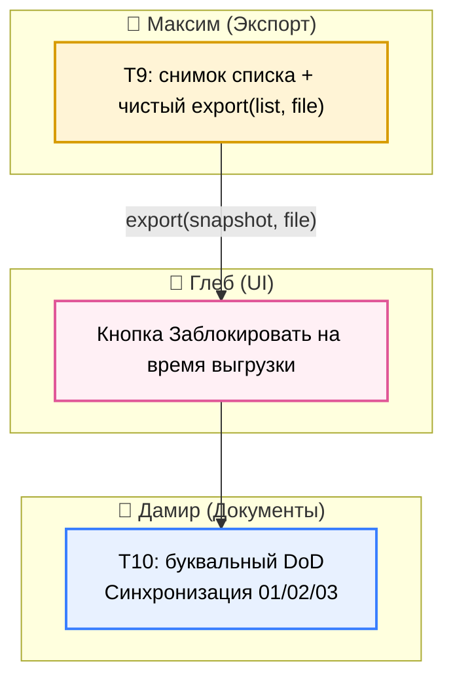
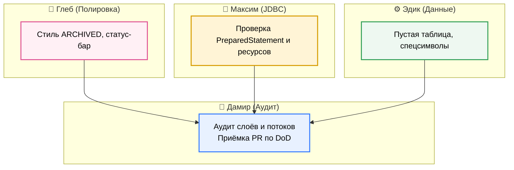
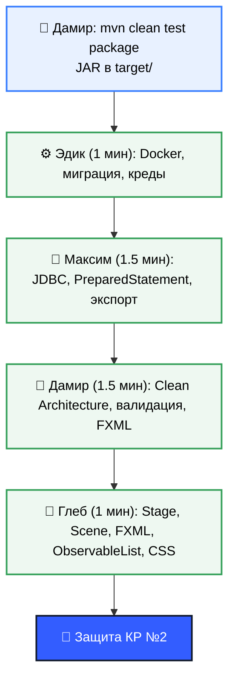

# 04. Командный план 7-дневного Agile-спринта (КР2)

> **Основа:** Джеймс Шор и Шэйн Уорден, «Искусство Agile-разработки» (2-е изд., O’Reilly, 2024).
> **Цель:** убрать простои и взаимные блокировки («жду, пока он напишет БД/DAO») и сдать КР №2 с первого раза.
> **Состав команды:**
> 1. **Дамир (тимлид):** сервисный слой, статистика, FXML-диалог, документы, приёмка по DoD.
> 2. **Глеб:** JavaFX UI, `MainView.fxml`, `app.css`, фильтры, `FxTasks`.
> 3. **Максим:** JDBC DAO, чистый экспорт CSV.
> 4. **Эдик:** миграция схемы, Docker, креды, `InMemoryVacancyDao`.

---

## 0. Площадка проекта (что уже готово)

Каркас собран и запускается — команда дописывает только свои части, а не поднимает проект с нуля.

- **Главное окно:** `view/MainView.fxml` с таблицей вакансий, фильтрами и кнопками; грузится в `HrApplication.start` через `FXMLLoader`.
- **Контроллер:** `ui/MainController` уже умеет CRUD-хуки, фильтры, поиск, экспорт и статистику.
- **Слои:** интерфейсы `repository/VacancyDao`, `repository/UserDao`; реализации `PostgresVacancyDao`, `PostgresUserDao`, `InMemoryVacancyDao`.
- **Данные без Docker:** `InMemoryVacancyDao` отдаёт 8 вакансий — UI и сервисы работают автономно.
- **БД:** `util/DatabaseManager` (fail-fast), `database.properties`, `javafx-client/migration_v2.sql`.
- **Асинхронность и UI-хелперы:** `ui/util/FxTasks`, `ui/util/UiUtils`, `ui/StatisticsDialog`.
- **Стили:** `css/app.css` с классами карточек статистики.

Каждый разработчик дописывает только свою часть: Дамир — сервисы и документы, Глеб — фильтры и фон, Максим — DAO и экспорт, Эдик — миграцию и креды.

---

## 1. Как решены блокировки из КР1

1. **Сквозной скелет:** приложение запускается через `mvn javafx:run` и показывает вакансии из `InMemoryVacancyDao` без Docker.
2. **Автономность через стаб:** UI и сервисы работают на стабе, пока Максим и Эдик поднимают реальную БД.
3. **Микро-дедлайны:** у каждого дня есть проверяемый DoD, а не «сделать к концу недели».

---

## 2. 7 дней спринта

### День 1. Реальная БД: миграция и креды (T1, T2)

> **Главная цель:** приложение реально подключается к базе КР1, а не только к стабу.

#### Mermaid-карта Дня 1


**Задачи:**
- **Эдик (до 12:00):** T1 — `migration_v2.sql`, бэкфилл `full_name` и `company_name`.
- **Эдик (до 15:00):** T2 — `database.properties` с `hr_user`/`hr_password`, fail-fast в `DatabaseManager`.
- **Максим (до 17:00):** сверить SQL `PostgresVacancyDao`/`PostgresUserDao` со схемой после миграции.
- **Дамир (до 15:00):** зафиксировать контракты `VacancyDao`/`UserDao`, принять T1 и T2.
- **Глеб (до 18:00):** проверить запуск `mvn javafx:run` с БД и без.

**DoD Дня 1:**
- [ ] 1. Выполнить `docker compose up -d`. **Ожидание:** контейнер `hr_system_postgres` активен (`Up`).
- [ ] 2. Запустить скрипт `migration_v2.sql` дважды. **Ожидание:** выполнение проходит без ошибок (идемпотентность).
- [ ] 3. Выполнить `psql -U hr_user -d hr_system_db -c "\d users"`. **Ожидание:** в выводе есть `full_name` и `company_name`.
- [ ] 4. Выполнить `grep -rn "postgres" javafx-client/src/main/java`. **Ожидание:** пустой вывод (нет захардкоженных паролей).
- [ ] 5. Удалить (или переименовать) `database.properties` и запустить проект. **Ожидание:** приложение падает с понятным сообщением (fail-fast), а не с `NullPointerException`.
- [ ] 6. Запустить приложение с Docker и без него. **Ожидание:** статус в шапке окна корректно меняется на «🟢 PostgreSQL подключен» или «🟠 Автономный режим (Stub)».

---

### День 2. Фильтры и асинхронность (T3, T4)

> **Главная цель:** два фильтра, поиск по трём полям, окно не зависает на запросах.

#### Mermaid-карта Дня 2


**Задачи:**
- **Глеб (до 14:00):** T3 — `salaryRangeFilterComboBox`, предикат `matchesSalaryRange`, поиск по `description`.
- **Глеб (до 18:00):** T4 — `FxTasks.run`, загрузка данных и работодателей в фон.
- **Максим (до 14:00):** `PostgresUserDao.findAllEmployers()` для выпадающего списка.
- **Эдик (до 18:00):** проверить healthcheck контейнера.
- **Дамир (до 16:00):** ревью контрактов сервисов и UI-хуков.

**DoD Дня 2:**
- [ ] 1. Открыть главное окно. **Ожидание:** отображаются два фильтра (статус и зарплата).
- [ ] 2. Выбрать фильтр «до 100 000». **Ожидание:** в таблице остаются только записи с `salaryMin <= 100000`.
- [ ] 3. Ввести в поиск «Spring». **Ожидание:** в таблице остаются только вакансии со словом Spring в описании или заголовке.
- [ ] 4. Выполнить `grep -n "getAllVacancies\|findAllEmployers" MainController.java`. **Ожидание:** вызовы лежат только внутри фоновых блоков `FxTasks.runAsync`.
- [ ] 5. Добавить `Thread.sleep(2000)` в DAO и запустить. **Ожидание:** при загрузке данных окно можно двигать, оно не зависает.

---

### День 3. Слои и статистика (T5, T7)

> **Главная цель:** сервисы без JavaFX; статистика работает и с Docker, и без.

#### Mermaid-карта Дня 3


**Задачи:**
- **Дамир (до 14:00):** T5 — окно статистики в `ui`; `service/**` без `javafx.*`.
- **Дамир (до 18:00):** T7 — расчёт метрик из `vacancyDao.findAll()`.
- **Максим (до 18:00):** проверить, что `findAll()` — единый источник для таблицы и статистики.
- **Эдик (до 18:00):** держать в стабе 8 вакансий.
- **Глеб (до 18:00):** проверка, что значения статистики совпадают с таблицей.

**DoD Дня 3:**
- [ ] 1. Выполнить `grep -rn "javafx" javafx-client/src/main/java/ru/mirea/hrsystem/service`. **Ожидание:** пустой вывод (сервисный слой чист).
- [ ] 2. Запустить приложение без Docker и нажать «Статистика». **Ожидание:** метрики показывают реальные цифры стаба, а не нули.
- [ ] 3. Запустить приложение с Docker и сверить метрики с прямым SQL-запросом. **Ожидание:** цифры совпадают 1 в 1.
- [ ] 4. Выбросить исключение в `StatisticsService`. **Ожидание:** в UI появляется диалоговое окно «Ошибка статистики».

---

### День 4. FXML-диалог и окно статистики (T6, T8)

> **Главная цель:** ключевые окна на FXML, окно статистики в слое `ui`.

#### Mermaid-карта Дня 4


**Задачи:**
- **Глеб (до 13:00):** T6 — `ui/StatisticsDialog.java`, стили `.metric-card`/`.metric-value`/`.metric-title`.
- **Дамир (до 18:00):** T8 — `view/VacancyDialog.fxml`, `ui/VacancyDialogController`, `FXMLLoader`, `EventFilter` на OK.
- **Максим (до 18:00):** `update()` и `delete()` через `PreparedStatement`.
- **Эдик (до 18:00):** проверить данные для карточек статистики.

**DoD Дня 4:**
- [ ] 1. Кликнуть кнопку «Статистика». **Ожидание:** открывается модальное окно с 5 карточками метрик.
- [ ] 2. Проверить исходник `StatisticsDialog.java`. **Ожидание:** стили назначаются через `.getStyleClass().add()`, inline-стилей `setStyle()` нет.
- [ ] 3. Открыть диалог новой вакансии, оставить поля пустыми и нажать «Сохранить». **Ожидание:** окно не закрывается, поля подсвечиваются красным.
- [ ] 4. Выбрать вакансию и нажать «Редактировать». **Ожидание:** открывается диалог, где все поля (включая ComboBox) заполнены текущими данными.

---

### День 5. Экспорт и честный DoD (T9, T10)

> **Главная цель:** безопасный экспорт и синхронизация документов с кодом.
> **Честный статус:** в прошлой версии плана День 5 был помечен как сданный, хотя статистика в stub-режиме показывала нули. Т7 закрыт в День 3; здесь проверяем экспорт и убираем из документов обещания, которых нет в коде.

#### Mermaid-карта Дня 5


**Задачи:**
- **Максим (до 14:00):** T9 — `CsvExportService.export(List<Vacancy>, File)`; снимок `new ArrayList<>(filteredData)` в `handleExportCsv()`.
- **Глеб (до 14:00):** дизейбл `exportButton` на время выгрузки.
- **Дамир (до 18:00):** T10 — переписать DoD дней, синхронизировать `01/02/03`.

**DoD Дня 5:**
- [ ] 1. Начать экспорт CSV и одновременно менять текст в строке поиска. **Ожидание:** ошибки `ConcurrentModificationException` не возникает (используется snapshot списка).
- [ ] 2. Нажать на «Экспорт в CSV». **Ожидание:** кнопка становится неактивной (`setDisable(true)`) и возвращается в исходное состояние только после сохранения файла.
- [ ] 3. Отфильтровать таблицу (например, 2 строки) и сделать экспорт. **Ожидание:** в CSV-файле ровно 2 строки данных + 1 строка заголовков.
- [ ] 4. Провести ревью `01_SYSTEM_ARCHITECTURE.md`. **Ожидание:** документы полностью описывают работу `FxTasks`, фильтров и миграции.

---

### День 6. Аудит и полировка

> **Главная цель:** проверить потокобезопасность, слои и граничные данные.

#### Mermaid-карта Дня 6


**DoD Дня 6:**
- [ ] 1. Выполнить `grep -rn "System.out" javafx-client/src/main/java`. **Ожидание:** пустой вывод (вместо него используется логгер или ничего).
- [ ] 2. Выполнить `grep -rn "java.sql" javafx-client/src/main/java/ru/mirea/hrsystem/ui`. **Ожидание:** пустой вывод (в контроллерах нет SQL).
- [ ] 3. Очистить таблицу и открыть статистику. **Ожидание:** все метрики равны `0`, исключений типа деления на ноль не возникает.
- [ ] 4. Добавить в название вакансии точку с запятой (`;`) и выгрузить CSV. **Ожидание:** в Excel текст в одной ячейке, сдвига соседних колонок нет (экранирование работает).

---

### День 7. Приёмка и защита

> **Главная цель:** пройти DoD, собрать JAR и отрепетировать защиту.

#### Mermaid-карта Дня 7


**DoD Дня 7:**
- [ ] 1. Выполнить `mvn clean test`. **Ожидание:** BUILD SUCCESS, все тесты пройдены.
- [ ] 2. Выполнить `mvn clean package`. **Ожидание:** в директории `target/` появляется собранный JAR-файл приложения.
- [ ] 3. Выполнить `mvn javafx:run` без запущенного Docker. **Ожидание:** таблица отображает ровно 8 строк (из стаба).
- [ ] 4. Продемонстрировать полный флоу на защите. **Ожидание:** показано создание, изменение, удаление, 2 фильтра, сортировка и экспорт CSV.

---

## 3. Правило оформления задач

Каждую задачу пишем так, чтобы исполнитель видел: площадка-каркас уже готова, остаётся написать только его часть. Полный чек-лист формата — в разделе 1 плана `kr2_light_tz_plan.md`; образцы — в персональных ТЗ ниже.

```markdown
## Tn. Название (действие)
**Исполнитель:** Имя | **Дедлайн:** День N, до HH:00 | **Ветка:** feature/...

**Платформа (уже готова):** существующие классы/утилиты, на которые исполнитель опирается.

**Тебе написать:**
1. конкретный класс/метод — что делает;
2. ...

**Не трогаешь:** что менять не нужно.
**Артефакты:** файлы/строки.
**DoD:**
- [ ] проверяемый пункт
```

Правила текста: активный залог («Добавь кнопку»), без канцелярита, абзац не длиннее 5 строк, технические сущности в `code`, важное — **жирным**.

---

## 4. Карта задач T1–T10

| # | Задача | Исполнитель | Дедлайн | ТЗ |
|---|--------|-------------|---------|-----|
| T1 | Привести схему БД к КР №1 | Эдик | День 1, 12:00 | [EDIK_DATABASE_STUB_PLAN.md](EDIK_DATABASE_STUB_PLAN.md) |
| T2 | Креды и fail-fast | Эдик | День 1, 15:00 | [EDIK_DATABASE_STUB_PLAN.md](EDIK_DATABASE_STUB_PLAN.md) |
| T3 | Второй фильтр и поиск по описанию | Глеб | День 2, 14:00 | [GLEB_JAVAFX_UI_PLAN.md](GLEB_JAVAFX_UI_PLAN.md) |
| T4 | Асинхронность через `FxTasks` | Глеб | День 2, 18:00 | [GLEB_JAVAFX_UI_PLAN.md](GLEB_JAVAFX_UI_PLAN.md) |
| T5 | Перенести отрисовку окна статистики в слой UI | Дамир | День 3, 14:00 | [DAMIR_VALIDATION_SERVICE_PLAN.md](DAMIR_VALIDATION_SERVICE_PLAN.md) |
| T6 | Окно статистики в `ui` | Глеб | День 4, 13:00 | [GLEB_JAVAFX_UI_PLAN.md](GLEB_JAVAFX_UI_PLAN.md) |
| T7 | Статистика через DAO | Дамир | День 3, 18:00 | [DAMIR_VALIDATION_SERVICE_PLAN.md](DAMIR_VALIDATION_SERVICE_PLAN.md) |
| T8 | Диалог вакансии в FXML | Дамир | День 4, 18:00 | [DAMIR_VALIDATION_SERVICE_PLAN.md](DAMIR_VALIDATION_SERVICE_PLAN.md) |
| T9 | Снимок списка для экспорта | Максим | День 5, 14:00 | [MAXIM_JDBC_DAO_PLAN.md](MAXIM_JDBC_DAO_PLAN.md) |
| T10 | Перебазировать DoD и документы | Дамир | День 5, 18:00 | [DAMIR_VALIDATION_SERVICE_PLAN.md](DAMIR_VALIDATION_SERVICE_PLAN.md) |

---

## 5. Приёмка кода (DoD)

Каждый сдаёт модуль тимлиду по чек-листу; при провале хотя бы одного пункта PR уходит на доработку.

1. **Сборка:** `mvn clean test` без ошибок.
2. **Чистота:** нет `System.out.println` и `e.printStackTrace()` (только SLF4J и диалоги `UiUtils`); нет паролей в коде; нет закомментированных блоков.
3. **Поток UI:** долгие операции (SQL, диск, экспорт) не вызываются в JavaFX Application Thread, а идут через `FxTasks`.
4. **Ошибки:** неверный ввод показывает `Alert.ERROR`, не роняет приложение; пустых `catch` нет.
5. **Слои:** в UI-контроллерах нет SQL; в сервисах и DAO нет импортов JavaFX.
