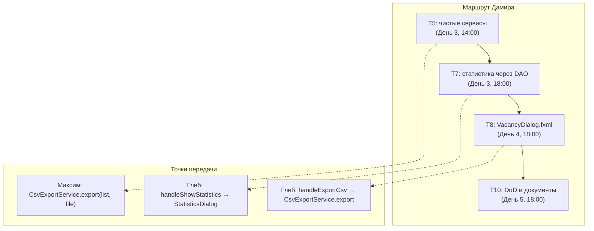

# Дамир — ТЗ: сервисный слой, статистика, FXML-диалог, документы

> **Роль:** тимлид, сервисный слой, валидация, приёмка по DoD.
> **Закреплённые файлы:**
> - `src/main/java/ru/mirea/hrsystem/service/StatisticsService.java`
> - `src/main/java/ru/mirea/hrsystem/service/CsvExportService.java`
> - `src/main/java/ru/mirea/hrsystem/ui/VacancyDialog.java` (обёртка диалога, T8)
> - `src/main/java/ru/mirea/hrsystem/ui/VacancyDialogController.java` (контроллер FXML, T8)
> - `src/main/resources/ru/mirea/hrsystem/view/VacancyDialog.fxml` (FXML-форма, T8)
> - `src/main/java/ru/mirea/hrsystem/ui/StatisticsDialog.java` (общий с Глебом, T6)
> - `04_TEAM_WORK_PLAN.md`

Задачи ниже — только твои: **T5, T7, T8, T10**. Формат лёгкого ТЗ: суть-глагол, контекст одной строкой, требования списком, проверяемый DoD.

---

## Git-ветка

**Ветка:** `feature/services-layers`
**Базовая ветка:** `main`
**В этой ветке выполняются все задачи файла:** T5, T7, T8, T10.

Порядок:
```bash
git switch main && git pull
git switch -c feature/services-layers
# коммиты по задачам: T5 → T7 → T8 → T10
git push -u origin feature/services-layers
# Pull Request в main → merge → удалить ветку
```

---

## T5. Перенести отрисовку окна статистики в слой UI

**Исполнитель:** Дамир | **Дедлайн:** День 3, до 14:00 | **Ветка:** `feature/services-layers`

**Платформа (уже готова):** `ui/StatisticsDialog.java` уже существует и умеет `show(Window owner, StatisticsDto dto)` с 5 карточками. `service/StatisticsService.java` уже принимает `VacancyDao` и возвращает `StatisticsDto`. `service/CsvExportService.export(List<Vacancy>, File)` уже пишет файл. `MainController.handleShowStatistics()` уже вызывает `StatisticsDialog.show(...)`.

**Тебе написать:**
1. Убедиться, что `service/**` не импортирует `javafx.*`: бизнес-логика живёт в `service`, интерфейс — в `ui`.
2. Если в `service` остался UI-код (окно, `Stage`, `Label`, `FileChooser`) — вынести его в `ui`.
3. Прогнать `grep -rn "javafx" src/main/java/ru/mirea/hrsystem/service` — вывод пустой.

**Почему так (одной строкой):** это требование `2.txt` — разделение Controller / Service / Repository / Database; на защите спросят «где бизнес-логика, а где интерфейс», поэтому слой `service` обязан быть чистым от JavaFX, а не «почищенным ради чистки».

**Не трогаешь:** DAO, `MainView.fxml`, `pom.xml`.
**Артефакты:** `service/StatisticsService.java`, `service/CsvExportService.java`, `ui/StatisticsDialog.java`.
**DoD:**
- [ ] `grep -rn "javafx" src/main/java/ru/mirea/hrsystem/service` — пусто.
- [ ] `new StatisticsService(vacancyDao)` работает без `DatabaseManager`.
- [ ] `CsvExportService.export(list, file)` пишет файл, не открывая окон.

---

## T7. Считать статистику через DAO

**Исполнитель:** Дамир | **Дедлайн:** День 3, до 18:00 | **Ветка:** `feature/services-layers`

**Платформа (уже готова):** `StatisticsService.calculateMetrics()` уже считает метрики из `vacancyDao.findAll()` в Java — один путь и для `PostgresVacancyDao`, и для `InMemoryVacancyDao`. `InMemoryVacancyDao` уже отдаёт 8 вакансий. `HrApplication.start` уже создаёт один `VacancyDao` и передаёт его в `VacancyService` и `StatisticsService`. `MainController.handleShowStatistics()` уже ловит сбой и показывает алерт «Ошибка статистики».

**Тебе написать:**
1. Убедиться, что `HrApplication.start` передаёт в `StatisticsService` тот же `VacancyDao`, что и в `VacancyService`.
2. Проверить, что сбой расчёта показывает алерт, а не окно с нулями.
3. Удалить мёртвые `calculateMetricsFromDb()` / `calculateMetricsFromList()`, если они есть.

**Не трогаешь:** SQL-агрегаты `COUNT(*) FILTER (...)`, раз Java-расчёт их заменяет.
**Артефакты:** `service/StatisticsService.java`, `HrApplication.java`, `ui/MainController.java` (`handleShowStatistics`).
**DoD:**
- [ ] Без Docker окно показывает `8 / 6 / 1 / 175 625 ₽ / 480 000 ₽`, а не `0`.
- [ ] С Docker значения совпадают с `SELECT` по БД.
- [ ] При сбое виден алерт, окно не открывается с нулями.

---

## T8. Диалог вакансии на FXML

**Исполнитель:** Дамир | **Дедлайн:** День 4, до 18:00 | **Ветка:** `feature/services-layers`

**Платформа (уже готова):** `view/VacancyDialog.fxml` создан. `ui/VacancyDialogController.java` содержит `@FXML`-поля и `initialize()` (конвертер `ComboBox<User>`, статусы). `ui/VacancyDialog.java` грузит FXML через `FXMLLoader`, передаёт контроллеру `employers` и `existingVacancy`, вешает `EventFilter` на OK. `view/MainView.fxml` — рабочий образец связки FXML↔контроллер.

**Тебе написать:**
1. Убедиться, что `fx:id` в `VacancyDialog.fxml` совпадают с полями `VacancyDialogController`.
2. Проверить, что валидация и `EventFilter` на кнопке OK не дают закрыть окно при ошибке.
3. Проверить предзаполнение при редактировании: поля и выбранный работодатель в `ComboBox`.

**Не трогаешь:** окно статистики (`ui/StatisticsDialog.java`), `MainView.fxml`.
**Артефакты:** `resources/ru/mirea/hrsystem/view/VacancyDialog.fxml`, `ui/VacancyDialogController.java`, `ui/VacancyDialog.java`.
**DoD:**
- [ ] Диалог грузится из FXML, `fx:id` совпадают с полями контроллера.
- [ ] Пустое название не закрывает окно, видна красная ошибка.
- [ ] При редактировании поля заполнены текущими значениями вакансии.

---

## T10. Перебазировать DoD и документы

**Исполнитель:** Дамир (тимлид) | **Дедлайн:** День 5, до 18:00 | **Ветка:** `feature/services-layers`

**Платформа (уже готова):** `04_TEAM_WORK_PLAN.md` с DoD по дням, документы `01/02/03`, `pom.xml` с `maven.compiler.release=21`. Готового кода задача не требует — нужно привести документы в соответствие с фактом.

**Тебе написать:**
1. В `04_TEAM_WORK_PLAN.md` сделать DoD каждого дня буквально проверяемым: число, действие, ожидаемый результат.
2. Синхронизировать `01/02/03` с кодом: описать `FxTasks` (T4), фильтр по зарплате (T3) и миграцию схемы (T1) так, как они реально работают.
3. Проверить, что в `pom.xml` стоит `maven.compiler.release=21`.

**Не трогаешь:** Java-код, FXML, `pom.xml` (только проверка версии).
**Артефакты:** `04_TEAM_WORK_PLAN.md`, `01_SYSTEM_ARCHITECTURE.md`, `02_FUNCTIONAL_SPECIFICATION.md`, `03_DATABASE_ARCHITECTURE.md`, `pom.xml`.
**DoD:**
- [ ] Каждый пункт DoD проверяется быстрее минуты.
- [ ] Нет пункта, который нельзя воспроизвести на демонстрации.
- [ ] `grep "release" javafx-client/pom.xml` → `21`.

---

## Точки передачи кода

| Кто → кому | Что передаётся | Ссылка в коде |
|---|---|---|
| Дамир → Глеб | расчёт метрик | Глеб вызывает `StatisticsService.calculateMetrics()` из `MainController.handleShowStatistics()`, результат отдаёт в `StatisticsDialog.show(owner, dto)` |
| Дамир → Глеб | контракт экспорта | `CsvExportService.export(List<Vacancy>, File)`; снимок делает `MainController.handleExportCsv()` |
| Дамир → Глеб | диалог вакансии | `MainController.handleAddVacancy()` / `handleEditVacancy()` создают `VacancyDialog` (грузится из `VacancyDialog.fxml`) |
| Дамир → Максим | сигнатура экспорта | `CsvExportService.export(List<Vacancy>, File)` без JavaFX |
| Дамир → команде | `StatisticsDto` | 5 полей: `totalVacancies`, `activeVacancies`, `archivedVacancies`, `averageSalaryMin`, `maxSalary` |

---

## Mermaid: маршрут Дамира


