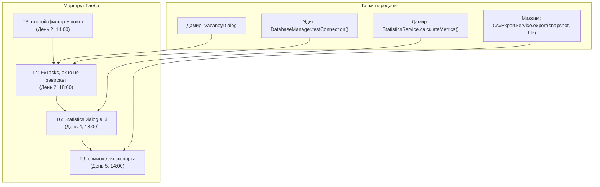

# Глеб — ТЗ: JavaFX UI, FXML, фильтры, асинхронность

> **Роль:** фронтенд-лид, JavaFX и FXML, таблица, фильтры, окна.
> **Закреплённые файлы:**
> - `src/main/resources/ru/mirea/hrsystem/view/MainView.fxml`
> - `src/main/resources/ru/mirea/hrsystem/css/app.css`
> - `src/main/java/ru/mirea/hrsystem/ui/MainController.java`
> - `src/main/java/ru/mirea/hrsystem/ui/util/FxTasks.java`
> - `src/main/java/ru/mirea/hrsystem/ui/util/UiUtils.java`
> - `src/main/java/ru/mirea/hrsystem/HrApplication.java`, `Launcher.java`

Задачи ниже — твои: **T3, T4, T6**, плюс UI-хук для **T9** (Максим). Формат лёгкого ТЗ: суть-глагол, контекст одной строкой, требования списком, проверяемый DoD.

---

## Git-ветка

**Ветка:** `feature/ui-filters-async`
**Базовая ветка:** `main`
**В этой ветке выполняются все задачи файла:** T3, T4, T6 и UI-часть T9.

Порядок:
```bash
git switch main && git pull
git switch -c feature/ui-filters-async
# коммиты по задачам: T3 → T4 → T6 → UI-часть T9
git push -u origin feature/ui-filters-async
# Pull Request в main → merge → удалить ветку
```

---

## T3. Добавить второй фильтр и поиск по описанию

**Исполнитель:** Глеб | **Дедлайн:** День 2, до 14:00 | **Ветка:** `feature/ui-filters-async`

**Платформа (уже готова):** `view/MainView.fxml` уже содержит `searchField`, `statusFilterComboBox` и `salaryRangeFilterComboBox`. `MainController.initialize()` уже связывает `masterData` → `FilteredList` → `SortedList`. `MainController.updateFilters()` уже имеет предикат `matchesSalaryRange(vacancy, range)` и поиск по `title`, `employerCompanyName`, `description`.

**Тебе написать:**
1. Довести фильтр зарплаты: `Вся зарплата`, `до 100 000`, `100 000–200 000`, `от 200 000` — сравнение `salaryMin` с границами `100 000` и `200 000`.
2. Довести поиск по `description`: `vacancy.getDescription() != null && ...contains(query)`.
3. Убедиться, что «Сброс» возвращает полный список и обнуляет оба фильтра.
4. Обновить `02_FUNCTIONAL_SPECIFICATION.md` под фактическое поведение.

**Не трогаешь:** фильтр по дате, мультивыбор статусов, сохранение фильтров между запусками.
**Артефакты:** `MainView.fxml` (панель фильтров), `MainController.updateFilters()`.
**DoD:**
- [ ] «до 100 000» оставляет вакансии с `salaryMin <= 100000`.
- [ ] «от 200 000» оставляет вакансии с `salaryMin >= 200000`.
- [ ] Поиск «Spring» находит вакансию по описанию.
- [ ] «Сброс» возвращает полный список и обнуляет оба фильтра.

---

## T4. Вынести долгие вызовы в FxTasks

**Исполнитель:** Глеб | **Дедлайн:** День 2, до 18:00 | **Ветка:** `feature/ui-filters-async`

**Платформа (уже готова):** `ui/util/FxTasks.run(Callable<T>, Consumer<T>, Consumer<Throwable>)` уже запускает работу в daemon-потоке и вызывает колбэки на FX-потоке. `MainController.loadDataFromService()`, `handleAddVacancy()` и `handleEditVacancy()` уже обёрнуты в `FxTasks.run`, а `setBusy(true/false)` дизейблит таблицу и кнопки. `UiUtils.showErrorAlert(...)` показывает ошибки.

**Тебе написать:**
1. Проверить, что `getAllVacancies` и `findAllEmployers` вызываются только внутри `FxTasks.run`.
2. Проверить, что `masterData.setAll(list)` и открытие диалога идут в `success`, а не в фоне.
3. Проверить дизейбл таблицы и кнопок через `setBusy(true/false)` на время загрузки.

**Не трогаешь:** собственный `ExecutorService`, пул потоков.
**Артефакты:** `ui/util/FxTasks.java`, `ui/MainController.java`.
**DoD:**
- [ ] `getAllVacancies` и `findAllEmployers` вызываются только внутри `FxTasks.run`.
- [ ] При искусственной задержке 2 сек в DAO окно двигается и не «белеет».
- [ ] При исключении виден алерт, интерфейс продолжает работать.

---

## T6. Вынести окно статистики в слой ui

**Исполнитель:** Глеб | **Дедлайн:** День 4, до 13:00 | **Ветка:** `feature/ui-filters-async`

**Платформа (уже готова):** `ui/StatisticsDialog.java` уже существует: метод `show(Window owner, StatisticsDto dto)`, 5 карточек и кнопка «Закрыть». `MainController.handleShowStatistics()` уже считает метрики через `FxTasks` и вызывает `StatisticsDialog.show(getStage(), dto)`. Классы `.metric-card`, `.metric-value`, `.metric-title` уже есть в `app.css`.

**Тебе написать:**
1. Дорисовать/проверить 5 карточек метрик и кнопку «Закрыть» в `StatisticsDialog`.
2. Убедиться, что стили карточек заданы классами в `app.css`, а не inline `setStyle(...)`.
3. Проверить, что `MainController.handleShowStatistics()` открывает окно именно через `StatisticsDialog.show(...)`.

**Не трогаешь:** графики, диаграммы, экспорт статистики.
**Артефакты:** `ui/StatisticsDialog.java`, `css/app.css`, `MainController.handleShowStatistics()`.
**DoD:**
- [ ] Окно открывается из `handleShowStatistics()`.
- [ ] 5 карточек видны, значения совпадают с данными таблицы.
- [ ] Стили карточек заданы классами в `app.css`, а не inline.

---

## Поддержка T9 (Максим): кнопка и снимок для экспорта

**Исполнитель:** Глеб (UI-часть), Максим (сервис) | **Дедлайн:** День 5, до 14:00 | **Ветка:** `feature/ui-filters-async`

**Платформа (уже готова):** `MainController.handleExportCsv()` уже открывает `FileChooser` на FX-потоке, снимает снимок `new ArrayList<>(filteredData)`, дизейблит `exportButton` и запускает `CsvExportService.export(snapshot, target)` через `FxTasks.run`. Кнопка `exportButton` уже есть в `MainView.fxml`.

**Тебе написать:**
1. Проверить, что `FileChooser` и снимок списка делаются на FX-потоке.
2. Проверить, что в экспорт уходит снимок `snapshot`, а не живая `filteredData`.
3. Проверить дизейбл `exportButton` на время выгрузки с разблокировкой в `success` и `failure`.

**Не трогаешь:** экспорт в `.xlsx`, выбор набора колонок.
**Артефакты:** `MainController.handleExportCsv()`, `service/CsvExportService.export`.
**DoD:**
- [ ] Во время экспорта можно менять фильтр и поиск — исключения нет.
- [ ] Кнопка экспорта заблокирована до завершения и разблокируется после.
- [ ] В файле ровно столько строк, сколько показано на момент старта.

---

## Точки передачи кода

| Кто → кому | Что передаётся | Ссылка в коде |
|---|---|---|
| Дамир → Глеб | метрики | `StatisticsService.calculateMetrics()` → `StatisticsDialog.show(owner, dto)` |
| Дамир → Глеб | диалог вакансии | `VacancyDialog` из `MainController.handleAddVacancy()` / `handleEditVacancy()` |
| Максим → Глеб | чистый экспорт | `CsvExportService.export(snapshot, target)` |
| Эдик → Глеб | статус БД | `DatabaseManager.testConnection()` → `MainController.setDbStatus(boolean)` |
| Глеб → команде | фон | `FxTasks.run(...)` — общий хелпер для фоновых вызовов |

---

## Mermaid: маршрут Глеба


